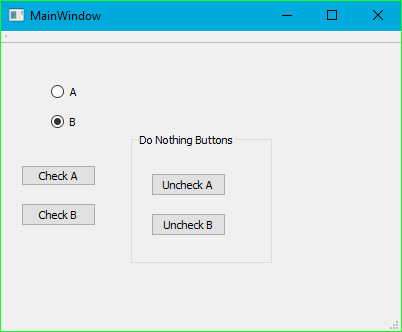

# QtRadioButtonUncheck
A repository showing that unchecking a QRadioButton in Qt 5.7.0 is ineffective

You can't uncheck a [`QRadioButton`](https://doc.qt.io/archives/qt-5.7/qradiobutton.html) using [`setChecked(false)`](https://doc.qt.io/archives/qt-5.7/qabstractbutton.html#checked-prop) 
to select the other one, it will just have no effect at all. You have to run `setChecked(true)` on a different `QRadioButton`.

